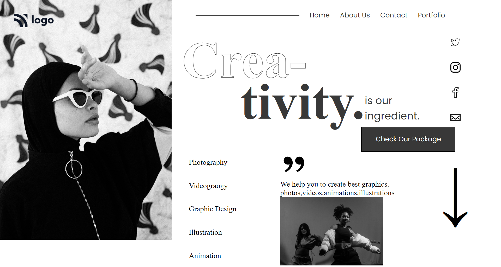

# Video creator's Website Landing Page  

## Languages used in this project
- HTML
- CSS

## Preview of this project

***

- ## [Live Project Here](https://geekyjedy-pro14.netlify.app/ "Netlify Live Project Link")

# About Me
> My name is **Jaydatt Ramkabir** currently i am learning full stack web development

## What i learned while building project ?
- ### HTML
    - `button`
    - `div`
    - `li`
    - `h1`
    - `p`
    - `section`
    - Many More...
- ### CSS
    - Positions
    - margins
    - paddings
    - flexbox
    - many more...

## How much time taken to build this ? 
>total 6 Hours
